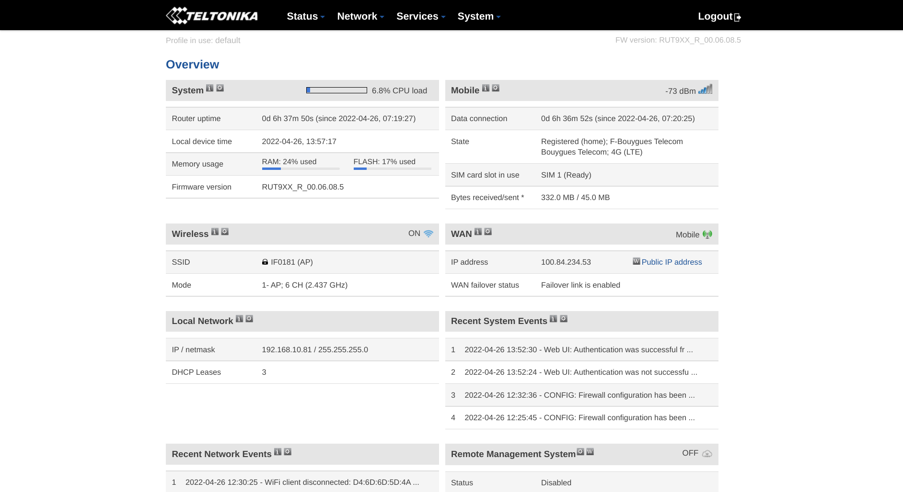
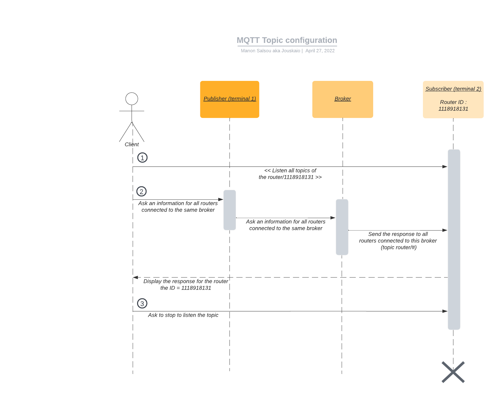

# Router RUT950

The RUT950 is a high-performance industrial Wi-FI 4G LTE router designed as a primary or backup Internet source and guarantees a reliable Internet connection with high data debit and redundancy. - [Teltonika](https://teltonika-networks.com/fr/product/rut950/)

## MQTT Setup

To enable transmission of router's performances by MQTT protocol to a broker, we will need to go to Services > MQTT

To send and get information with this protocol we will need to enable the MQTT Publisher.
To do this, you will need to 
- check "Enable"
- Hostname : the IP/HTTP address of your broker (ex : 52.47.138.176 or https://test.mosquitto.org/)
- Port : by default 1883
- Username
- Password

Save the changes.

Now, before starting to listen and publish on topic, we will need to understand how this router work.

Now that we have configured the MQTT service, we can ask router's information thanks to it.

As the diagram explains, we need to have two  two terminal : one to publish and the other to receipt the information.

Before starting, we need to get the router's identifiant in Status > Device > Serial Number (exemple : 1118918131)

**Subscription : Point 1 :**

Then, we will need to start to listen all topics concerning this router with this ID 1118918131. To do it, enter this command in your first terminal (terminal 2) (the -h is the hostname, could be HTTP or IP): 
`mosquitto_sub -h 52.47.138.176 -p 1883 -u username -P password -t router/1118918131/#`

For information, in MQTT the "#" means "all topic".

> **Nota Bene :**
> 
> If you want to get information about all routers connected to this broker, you can do this one `mosquitto_sub -h 52.47.138.176 -p 1883 -u username -P password -t router/#`

**Publish : Point 2 :**

Now that we are looking all information about this router, we will ask information about id and temperature of each routers connected with this command `mosquitto_pub -h 52.47.138.176 -p 1883 -u username -P password -t router/get -m id -m connection`

### Parameters router

List of all parameters the router's can send about itself by MQTT.

| Parameter name  |              Parameter description               |                                   Supported devices |
|-----------------|:------------------------------------------------:|----------------------------------------------------:|
| **temperature** | Temperature of the module in 0.1 degrees Celsius |             RUT2, RUT9, RUTX,  RUT3, TCR1, TRB2 |
| **operator**    |             Current operator’s name              |  RUT2, RUT9, RUTX,  RUT3, TCR1, TRB1,  TRB2 |
| **signal**      |             	Signal strength in dBm              |  RUT2, RUT9, RUTX,  RUT3, TCR1, TRB1,  TRB2 |
| **network**     |                  	Network state                  | 	RUT2, RUT9, RUTX,  RUT3, TCR1, TRB1,  TRB2 |
| **connection**  |      	Current connection type (2G, 3G, 4G)       |  RUT2, RUT9, RUTX,  RUT3, TCR1, TRB1,  TRB2 |
| **wan**         |                 	WAN IP address                  | 	RUT2, RUT9, RUTX,  RUT3, TCR1, TRB1,  TRB2 |
| **uptime**      |            	System uptime in seconds             |  RUT2, RUT9, RUTX,  RUT3, TCR1, TRB1,  TRB2 |
| **name**        |              	Device's device code               |  RUT2, RUT9, RUTX,  RUT3, TCR1, TRB1,  TRB2 |
| **digital1**    |          	Value of digital input no. 1           |                                                RUT9 |
| **digital2**    |          	Value of digital input no. 2           |                                                RUT9 |
| **analog**      |                 	Value of analog                 |                                          RUT9, TRB2 |
| **pin2**        |             	Value of 2's pin state              |                                                TRB2 |
| **pin3**        |             	Value of 3's pin state              |             RUT2, RUT9, RUTX,  RUT3, TRB1, TRB2 |
| **pin4**        |              Value of 4's pin state              |             RUT2, RUT9, RUTX,  RUT3, TRB1, TRB2 |

## Establish communication between RUT950 and Thingsboard

If we used the script once, you will note that you have to execute minimum two console to listen and receipt the information. And to get information every n times, we need to use a service that will send and receipt information each every x times.

To get it, you need to get this script in [Annexe](../../Annexes/Docker_LinuxAlpine)
> To do a simulation in docker container :
> 1. Build this image (linux with bash installed) by writing `sh launch.sh` or `docker-compose build`
> 2. Create a first container if not existing and access to its shell by running `docker exec -it rut950_service /bin/sh` or in detached mode `docker exec -it -d rut950_service /bin/sh`
> 3. If the container already exists, juste use the same commands above and remplaces rut950_service by the name's container
> 4. To leave the console, do CTL+D or `exit`
> 5. To stop a container which is running in detached mode, do `docker stop rut950_service`
> Source : [How to retain docker alpine container after exit is used ? - Stackoverflow](https://stackoverflow.com/questions/45638784/how-to-retain-docker-alpine-container-after-exit-is-used)

## Documentation

### MQTT

* [User Manual RUT950 LTE Router - Davantel.com](https://www.davantel.com/wp-content/uploads/2021/07/RUT950_manual_v1_41.pdf)
* [Monitoring via MQTT - Wiki Teltonika](https://wiki.teltonika-networks.com/view/Monitoring_via_MQTT)
* [RUT9XX MQTT Configuration - Community Teltnonika](https://community.teltonika-networks.com/?qa=blob&qa_blobid=2287383291337426026)